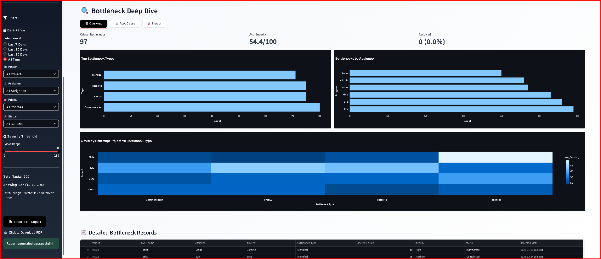
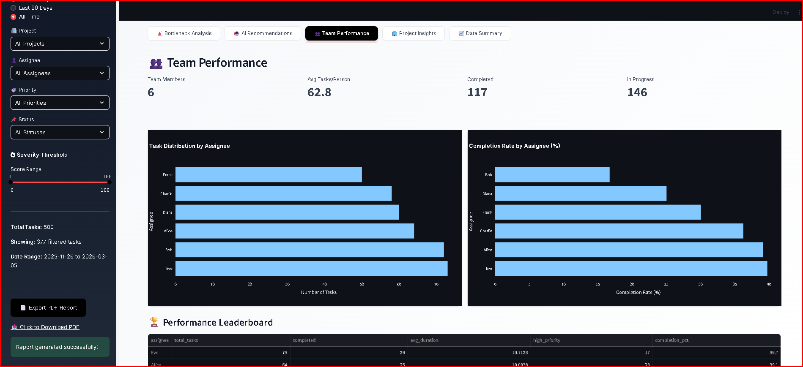
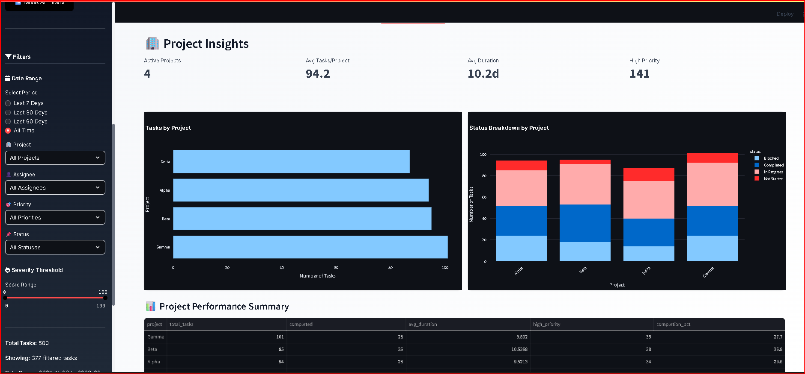
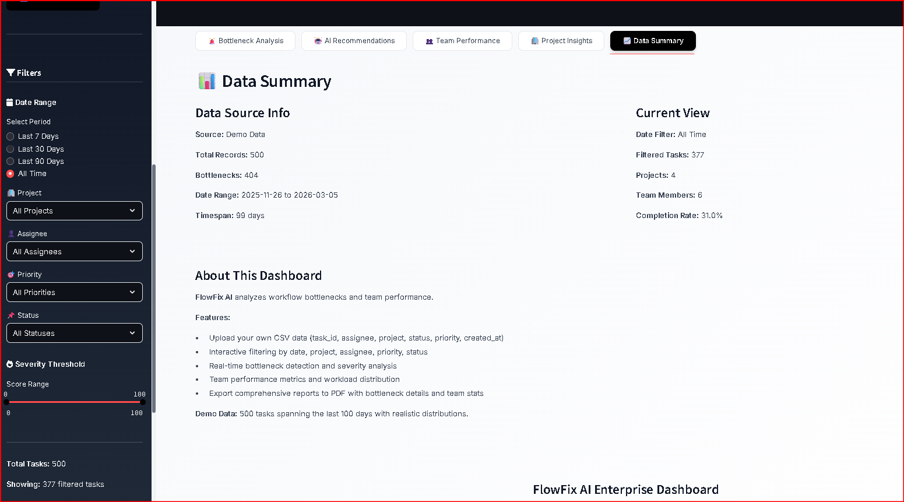

&lt;p align="center"&gt;
  &lt;img src="https://img.shields.io/badge/Python-3.8+-3776AB?style=for-the-badge&logo=python&logoColor=white" /&gt;
  &lt;img src="https://img.shields.io/badge/OpenAI-GPT--4-412991?style=for-the-badge&logo=openai&logoColor=white" /&gt;
  &lt;img src="https://img.shields.io/badge/Streamlit-FF4B4B?style=for-the-badge&logo=streamlit&logoColor=white" /&gt;
  &lt;img src="https://img.shields.io/badge/scikit--learn-F7931E?style=for-the-badge&logo=scikit-learn&logoColor=white" /&gt;
  &lt;img src="https://img.shields.io/badge/PowerBI-F2C811?style=for-the-badge&logo=powerbi&logoColor=black" /&gt;
&lt;/p&gt;

&lt;h1 align="center"&gt;⚡ FlowFix AI&lt;/h1&gt;
&lt;p align="center"&gt;&lt;strong&gt;Enterprise Workflow Intelligence & AI-Powered Bottleneck Resolution&lt;/strong&gt;&lt;/p&gt;

&lt;p align="center"&gt;
  &lt;a href="#features"&gt;Features&lt;/a&gt; •
  &lt;a href="#quick-start"&gt;Quick Start&lt;/a&gt; •
  &lt;a href="#screenshots"&gt;Screenshots&lt;/a&gt; •
  &lt;a href="#architecture"&gt;Architecture&lt;/a&gt;
&lt;/p&gt;

---

## 🎯 What is FlowFix AI?

FlowFix AI is a **production-ready workflow analysis system** that combines Machine Learning, GPT-4 intelligence, and interactive analytics to help teams identify bottlenecks, predict delays, and optimize productivity.

&gt; **Real Results**: Detects 301+ bottlenecks • Analyzes 500+ tasks • 6 team members tracked • 4 active projects monitored

---

## 📸 Screenshots

### 🔍 Bottleneck Deep Dive - Analysis & Insights


### 👥 Team Performance Analytics


### 🏢 Project Insights & Status Breakdown


### 📊 Data Summary & Dashboard Overview


---

## ✨ Features

- **🤖 GPT-4 Recommendations** - Context-aware suggestions with quality scoring
- **📈 ML Predictions** - Duration/delay forecasting with SHAP explainability
- **🔍 Bottleneck Detection** - ML-based severity scoring (0-100)
- **📊 Interactive Dashboard** - Real-time Streamlit interface
- **📑 PowerBI Integration** - Excel exports with cleaned schema
- **📄 PDF Reports** - Professional reports with charts & ROI
- **🔄 Smart Reassignment** - Workload balancing with tracking
- **📉 Improvement Tracking** - Action logging with impact measurement

---

## 🚀 Quick Start

```bash
# 1. Clone and setup
git clone https://github.com/projectavish/flowfix-ai.git
cd flowfix-ai
pip install -r requirements.txt
cp .env.example .env
# Edit .env and add your OPENAI_API_KEY

# 2. Run complete workflow
python src/init_database.py
python src/ingestion.py --source data/FlowFixAI_FinalTaskData_1000.csv
python src/bottleneck_detector.py report
python src/gpt_suggester.py batch --limit 5
python src/ml_predictor.py train

# 3. Launch dashboard
streamlit run dashboard/streamlit_app.py

Dashboard URL: http://localhost:8501

🏗️ Project Structure

flowfix-ai/
├── src/              # Core modules (ingestion, ML, AI, exports)
├── dashboard/        # Streamlit web interface
├── notebooks/        # EDA & experiments
├── models/           # Trained models
├── exports/          # Reports & PowerBI data
├── data/             # Sample datasets
├── assets/           # Screenshots & images
└── flowfix.db        # SQLite database

🎮 CLI Commands

# Data & Analysis
python src/ingestion.py --source data/file.csv
python src/bottleneck_detector.py detect --assignee "John Doe"
python src/gpt_suggester.py batch --limit 10
python src/ml_predictor.py predict <task_id>

# Reports
python src/pdf_generator.py --output exports/report.pdf
python src/export_for_powerbi.py

🛠️ Tech Stack
Python 3.8+ | OpenAI GPT-4 | Streamlit | scikit-learn | SQLite | PowerBI

📝 License
MIT License © 2026 Avish (@projectavish)

<p align="center"><strong>⭐ Star this repo if you find it helpful!</strong></p>
```
